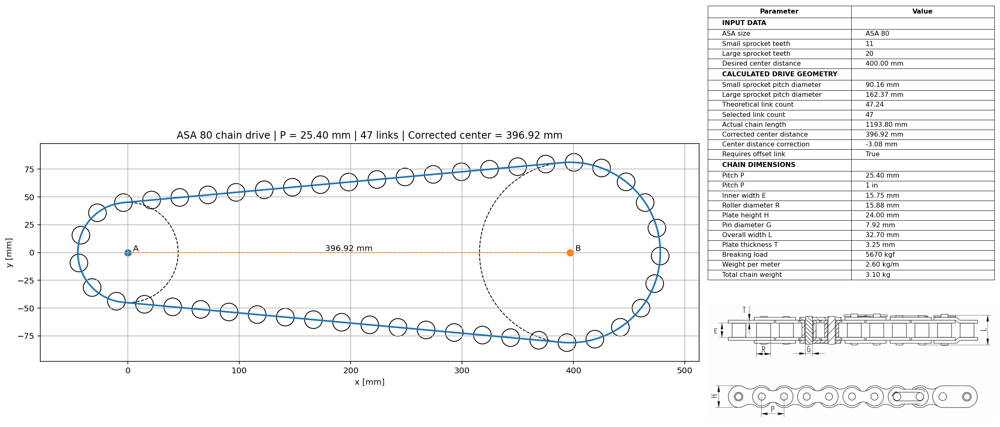
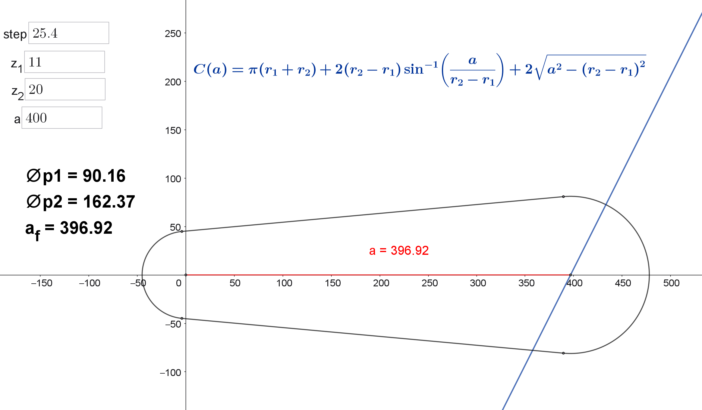

````markdown
# ASA Roller Chain Drive Calculator

Python tool for geometric calculation and corrected center distance of open ASA roller chain drives.

This project calculates the geometry of an open roller chain drive using ASA single-strand roller chain catalog data. It determines sprocket pitch diameters, theoretical chain length, selected integer link count, actual chain length, corrected center distance, tangency points, roller distribution, and estimated total chain weight.



---

## Overview

In a roller chain drive, the desired center distance between two sprockets does not always correspond to a physically closable chain assembly.

The geometric chain path is continuous, but the actual chain length is discrete because the chain is composed of an integer number of links. As a result, after selecting the nearest feasible number of links, the original center distance usually needs to be corrected.

This tool solves that problem by calculating the corrected center distance required to close the selected chain length exactly.

The project uses catalog dimensions extracted from an ASA roller chain reference table and applies analytical geometry to model the chain path over the sprocket pitch circles.

---

## Engineering Problem

For an open chain drive with two sprockets, the user usually defines:

- the chain size;
- the number of teeth of the smaller sprocket;
- the number of teeth of the larger sprocket;
- the desired center distance.

However, the desired center distance generates a theoretical chain path length that may not be compatible with an integer number of chain links.

The problem is therefore:

> Given the desired center distance and sprocket geometry, determine the nearest integer number of chain links and calculate the corrected center distance that closes the real chain length.

The key technical step is that the corrected center distance is obtained by solving a nonlinear geometric closure equation after the link count has been discretized.

---

## Features

- Load ASA roller chain dimensions from a catalog CSV file
- Select chain data by ASA chain size
- Calculate sprocket pitch diameters
- Calculate sprocket pitch radii
- Calculate open-chain continuous path length
- Estimate theoretical link count
- Select integer number of links
- Detect odd link count and offset link requirement
- Calculate actual chain length
- Solve corrected center distance
- Calculate center distance correction
- Calculate tangency points for the corrected geometry
- Plot sprocket pitch circles, chain path and roller positions
- Estimate total chain weight from catalog weight per meter
- Generate a visual output of the chain drive geometry

---

## Mathematical Background

For a roller chain with pitch `p` and a sprocket with `z` teeth, the sprocket pitch diameter is calculated by:

```math
D_p = \frac{p}{\sin\left(\frac{\pi}{z}\right)}
````

For an open chain drive with pitch radii `r1` and `r2`, center distance `a`, and radius difference:

```math
\Delta r = r_2 - r_1
```

the continuous chain path length is:

```math
C_i(a) =
\pi(r_1+r_2)
+
2\Delta r \arcsin\left(\frac{\Delta r}{a}\right)
+
2\sqrt{a^2-\Delta r^2}
```

The physically valid domain is:

```math
a > |\Delta r|
```

This condition ensures that the external tangent spans exist between the two sprocket pitch circles and that the square-root term remains real.

The theoretical number of links is:

```math
n_i = \frac{C_i}{p}
```

The selected number of links is obtained by rounding the theoretical value:

```math
n = \operatorname{round}(n_i)
```

The actual chain length is:

```math
C = np
```

After the link count is selected, the corrected center distance is obtained by solving the nonlinear error function:

```math
f(a) = C_i(a) - C
```

The corrected center distance `af` satisfies:

```math
f(a_f) = 0
```

which means:

```math
C_i(a_f) = C
```



---

## Example: ASA 80 Chain Drive

The following example evaluates an ASA 80 roller chain drive.

### Input Data

| Parameter               |     Value |
| ----------------------- | --------: |
| ASA chain size          |    ASA 80 |
| Chain pitch             |  25.40 mm |
| Smaller sprocket teeth  |        11 |
| Larger sprocket teeth   |        20 |
| Desired center distance | 400.00 mm |

### Calculated Results

| Result                          |      Value |
| ------------------------------- | ---------: |
| Smaller sprocket pitch diameter |   90.16 mm |
| Larger sprocket pitch diameter  |  162.37 mm |
| Theoretical link count          |      47.24 |
| Selected link count             |         47 |
| Actual chain length             | 1193.80 mm |
| Corrected center distance       |  396.92 mm |
| Center distance correction      |   -3.08 mm |
| Requires offset link            |       True |

For this case, the desired center distance of 400.00 mm does not close the selected 47-link chain. The corrected center distance is 396.92 mm, meaning the center distance must be reduced by 3.08 mm.

Because the selected number of links is odd, the physical chain assembly requires an offset link.

---

## Technical Article

A complete technical article is included in the repository:

[Technical Article PDF](docs/asa_chain_drive_article.pdf)

The article presents the full mathematical formulation, including:

* problem definition;
* modeling assumptions;
* sprocket pitch diameter calculation;
* open chain drive geometry;
* link count discretization;
* nonlinear corrected center distance equation;
* physical domain of the center distance function;
* tangency point calculation;
* numerical example;
* geometric validation.

---

## Installation

Clone this repository and enter the project folder:

```bash
git clone https://github.com/douglasdschons/asa-roller-chain-drive-calculator.git
cd asa-roller-chain-drive-calculator
```

Install the required dependencies:

```bash
pip install -r requirements.txt
```

---

## Requirements

The project uses:

```txt
numpy
pandas
matplotlib
scipy
```

`scipy` is required if the corrected center distance is solved using numerical root-finding methods such as `brentq`, `fsolve`, or equivalent algorithms.

---

## Usage

Run the ASA 80 example:

```bash
python examples/example_asa80.py
```

The script loads the chain catalog, calculates the chain drive geometry, solves the corrected center distance and plots the final chain path.

A typical workflow is:

```python
catalog = load_chain_catalog("data/enco_asa_chains.csv")

chain_data = get_chain_data(catalog, "80")

result = calculate_chain_drive_geometry(
    chain_data=chain_data,
    small_sprocket_teeth=11,
    large_sprocket_teeth=20,
    desired_center_distance=400.0
)

plot_chain_drive_geometry(result)
```

The calculation returns values such as:

* sprocket pitch diameters;
* pitch radii;
* theoretical chain length;
* theoretical link count;
* selected integer link count;
* actual chain length;
* corrected center distance;
* center distance correction;
* offset link requirement;
* tangency points;
* estimated total chain weight.

---

## Project Structure

The repository is currently organized as follows:

```text
asa-roller-chain-drive-calculator/
│
├── README.md
├── LICENSE
├── requirements.txt
├── .gitignore
│
├── data/
│   └── enco_asa_chains.csv
│
├── docs/
│   ├── asa_chain_drive_article.pdf
│   ├── asa_chain_drive_article.tex
│   └── figures/
│       ├── figure_1.png
│       ├── figure_2.png
│       ├── figure_3.png
│       └── figure_4.png
│
├── examples/
│   ├── example_asa80.py
│   └── asa80_output.png
│
└── chain_drive_geometry.py
```

A future package-oriented structure may move the core modules to:

```text
src/
└── asa_chain_drive/
    ├── __init__.py
    ├── catalog.py
    ├── geometry.py
    ├── plotting.py
    └── report.py
```

---

## Catalog Data

The tool uses ASA roller chain catalog data extracted from the ENCO catalog.

The catalog includes dimensions such as:

| Symbol           | Description                |
| ---------------- | -------------------------- |
| P                | Chain pitch                |
| E                | Inner width between plates |
| R                | Roller diameter            |
| H                | Plate height               |
| G                | Pin diameter               |
| L                | Overall chain width        |
| T                | Plate thickness            |
| Weight per meter | Chain mass per unit length |

The selected chain is identified by ASA size, such as:

* ASA 25
* ASA 35
* ASA 40
* ASA 50
* ASA 60
* ASA 80
* ASA 100
* ASA 120

---

## Scope and Assumptions

This project currently focuses on the geometric calculation of open roller chain drives.

The model assumes:

* two sprockets;
* open chain drive configuration;
* single-strand roller chain;
* coplanar sprockets;
* parallel sprocket axes;
* chain path represented by roller center trajectory;
* sprockets represented by pitch circles;
* external tangent spans;
* integer number of links;
* nearest-integer link count selection.

Odd link counts are mathematically accepted. However, when the selected number of links is odd, the physical assembly requires an offset link.

---

## Limitations

This tool does not perform complete mechanical chain drive design.

The current version does not evaluate:

* transmitted power;
* chain tension;
* service factor;
* lubrication;
* wear;
* fatigue;
* shock loading;
* chain elongation;
* sprocket tooth strength;
* shaft loads;
* bearing loads;
* dynamic effects;
* polygonal speed variation;
* manufacturer-specific load ratings.

The current scope is restricted to geometric closure and visualization.

For real machine design, the geometric result must be combined with manufacturer recommendations, load capacity calculations, service factors and safety checks.

---

## Roadmap

* [x] ASA chain catalog loading
* [x] Chain size selection
* [x] Sprocket pitch diameter calculation
* [x] Open chain path length calculation
* [x] Theoretical link count calculation
* [x] Integer link count selection
* [x] Offset link requirement detection
* [x] Corrected center distance calculation
* [x] Tangency point calculation
* [x] Chain path plotting
* [x] Roller distribution plotting
* [x] Chain weight estimation
* [x] Technical article in LaTeX/PDF
* [ ] Refactor code into a Python package structure
* [ ] Add unit tests
* [ ] Add even-link-count option
* [ ] Add automatic PDF report generation
* [ ] Add Streamlit interface
* [ ] Add support for additional chain standards
* [ ] Add load-based chain selection
* [ ] Add service factor calculations
* [ ] Add chain speed calculation
* [ ] Add sprocket recommendation checks
* [ ] Add documentation website

---

## Portfolio Context

This project is part of a mechanical-engineering-to-software portfolio focused on transforming classical engineering calculations into documented, reusable and auditable Python tools.

The goal is to demonstrate:

* mechanical engineering knowledge;
* mathematical modeling;
* computational implementation;
* technical documentation;
* Python applied to engineering problems;
* data-driven catalog usage;
* visualization of mechanical systems;
* development of reusable engineering software.

---

## License

This project is intended for educational and engineering study purposes.

A license file should be added before public release.

Recommended options:

* MIT License, for maximum openness and reuse;
* Apache 2.0 License, if explicit patent and contribution terms are desired.

---

## Author

**Douglas Delorenzi Schons**
Mechanical Engineer

Project focus: mechanical engineering, computational geometry, engineering calculations, Python tools and technical software development.

---

## Disclaimer

This software is provided for educational and preliminary engineering calculation purposes only.

The results should not be used as the sole basis for final machine design without proper engineering verification, manufacturer data, load analysis and safety validation.

```
```
